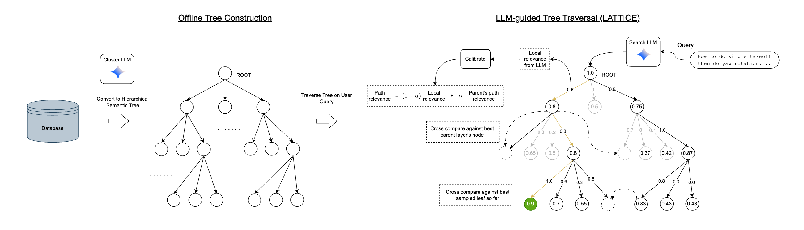
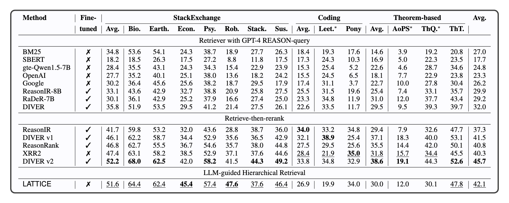
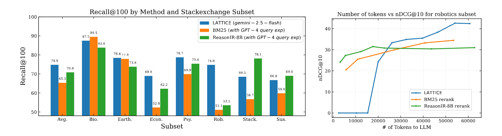

# LATTICE: LLM-guided Hierarchical Retrieval

[](https://arxiv.org/abs/2510.13217)
[](LICENSE)
<!-- [](https://github.com/nilesh2797/lattice) -->

**Official implementation of [LLM-Guided Hierarchical Retrieval](https://arxiv.org/abs/2510.13217)**  
Nilesh Gupta, Wei-Cheng Chang, Ngot Bui, Cho-Jui Hsieh, Inderjit S. Dhillon  
*UT Austin · UCLA · Google*


> TLDR; LATTICE turns retrieval into an LLM-driven navigation problem over a semantic scaffold. That scaffold gives the method both the computational tractability needed for large corpora and the contextual reasoning required for complex queries.


## 🚀 Overview

LATTICE proposes an LLM-native retrieval paradigm that combines the efficiency of hierarchical search with the reasoning power of modern large language models. Instead of relying on a static retriever + reranker pipeline or attempting to place a large corpus directly in an LLM context, LATTICE organizes the corpus into a semantic tree and uses an LLM as an *active search agent* that navigates that tree. This design yields logarithmic search complexity while preserving the LLM’s ability to perform nuanced, multi-step relevance judgments for complex, reasoning-heavy queries.

<p align="center">
  
</p>

### Key ideas
- **Semantic tree index:** The corpus is structured offline into a hierarchy of internal nodes (LLM-generated summaries) and leaf nodes (documents). This tree constrains the search space and makes traversal efficient.
- **LLM-guided traversal:** At query time, a search LLM scores small candidate slates of sibling nodes and provides explicit reasoning. These local judgments drive a best-first traversal (beam expansion) instead of flat reranking.
- **Global calibration:** LLM scores are context-dependent and noisy, LATTICE tries to estimate *latent* relevance scores and aggregates into a *path relevance* score (smoothed via a momentum α) so nodes across branches are comparable.
- **Two tree construction strategies:** (1) **Bottom-up** — agglomerative clustering and LLM summarization (good when passages belong to larger source documents); (2) **Top-down** — LLM-driven divisive clustering using multi-level summaries (better when documents are conceptually distinct).

### Why it matters
- **Efficiency:** Traversing a semantic tree requires far fewer LLM evaluations than reranking long flat lists; search cost grows roughly logarithmically with corpus size.
- **Reasoning-aware retrieval:** The search LLM's in-context reasoning allows retrieval to capture deeper, multi-step relevance signals that simple embeddings or keyword matchers miss.
- **Strong zero-shot results:** In experiments on BRIGHT, LATTICE substantially improves retrieval recall and ranking quality in zero-shot settings.


## 🧩 Installation

### Setup

1. **Clone the repository:**
   ```bash
   git clone https://github.com/nilesh2797/lattice
   cd lattice/release
   ```

2. **Install dependencies:**
   ```bash
   pip install -r src/requirements.txt
   ```

3. **Download pre-built semantic trees:**
   ```bash
   git clone https://huggingface.co/datasets/quicktensor/lattice-bright-trees ./trees/BRIGHT
   ```

4. **Set up API credentials:**
   ```bash
   export GOOGLE_API_KEY=your_api_key_here
   ```


## Usage

### Quick Start
Run a single experiment:
```bash
cd src
python run.py --subset biology --tree_version bottom-up --num_iters 20
```

### Batch Experiments
```bash
cd src
bash run.sh
```

### Configuration

| Parameter | Description | Default |
|-----------|-------------|---------|
| `--subset` | Dataset subset (biology, economics, etc.) | Required |
| `--tree_version` | Tree construction method (bottom-up/top-down) | Required |
| `--num_iters` | Number of retrieval iterations | 20 |
| `--max_beam_size` | Beam size during traversal | 2 |
| `--relevance_chain_factor` | Weight for current score in path relevance | 0.5 |
| `--reasoning_in_traversal_prompt` | Enable reasoning (thinking budget) | -1 (enabled) |
| `--rerank` | Additional reranking on final results | False |
| `--load_existing` | Resume from checkpoint defined by hyperparams | False |
| `--suffix` | Experiment name suffix | - |

For a complete list, see [`src/hyperparams.py`](src/hyperparams.py).

### 🗂️ Project Structure

```
lattice/release/
├── src/
│   ├── run.py              # Main execution script
│   ├── run.sh              # Batch execution wrapper
|   ├── run.ipynb           # Jupyter notebook for running / debugging experiments
│   ├── hyperparams.py      # Hyperparameter definitions
│   ├── tree_objects.py     # Semantic tree and sample objects
│   ├── llm_apis.py         # LLM API wrappers
│   ├── prompts.py          # Prompt templates
│   ├── utils.py            # Utility functions
│   └── calib_utils.py      # Calibration utilities
├── trees/
│   └── BRIGHT/             # Pre-built semantic trees
├── results/
│   └── BRIGHT/             # Experiment results
└── logs/                   # Execution logs
```

## 📊 Results
### Ranking results on BRIGHT
<p align="center">
  
</p>

### Retrieval results & cost analysis on Stackexchange datasets from BRIGHT
<p align="center">
  
</p>


## 📜 Citation

If you find this work helpful, please cite:

```bibtex
@article{gupta2025lattice,
  title={LLM-Guided Hierarchical Retrieval},
  author={Gupta, Nilesh and Chang, Wei-Cheng and Bui, Ngot and Hsieh, Cho-Jui and Dhillon, Inderjit S.},
  journal={arXiv preprint arXiv:2510.13217},
  year={2025}
}
```